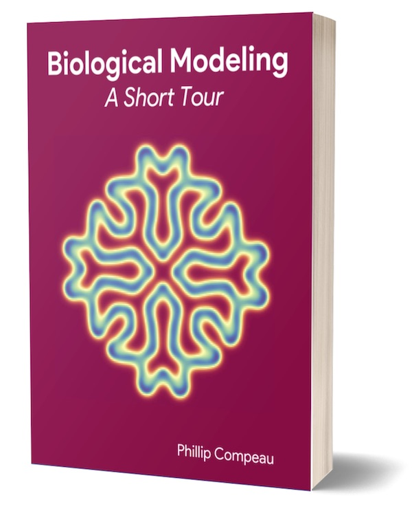

*Biological Modeling: A Short Tour* is now available in both print and e-book formats.

* **E-book ($9.95):** [Buy on Leanpub](https://leanpub.com/biologicalmodeling){:target="_blank"}
* **Print edition:** [Buy on Amazon](https://www.amazon.com/Biological-Modeling-Short-Phillip-Compeau/dp/B0BT6B2B8W){:target="_blank"}

[{: .align-center loading="lazy"}](https://www.amazon.com/Biological-Modeling-Short-Phillip-Compeau/dp/B0BT6B2B8W)

## Why the book?

The free course on this website is comprehensive — but it's also large, full of software tutorials, and built for screen-by-screen reading. The book offers something different:

* **One clean narrative.** Each chapter poses a single compelling biological question and answers it through mathematical modeling — no sidebars, no installation guides, just the story.
* **Read anywhere.** The e-book works offline on any device. The print edition travels with you.
* **A reference you can search, highlight, and annotate.** Much easier to revisit than a website spread across dozens of pages.
* **Beautiful figures.** Every illustration from the course, laid out for the page in full color.
* **Support free education.** Your purchase helps keep this course free for everyone.

## What's inside

*Biological Modeling: A Short Tour* follows the conceptual core of the course across five chapters:

1. **Prologue** — Why do zebras have stripes? We model Turing patterns emerging from reaction-diffusion systems.
2. **Module 1** — How do cells regulate their own genes? We explore transcription factor networks and the motifs that evolution has discovered.
3. **Module 2** — How does a single-celled bacterium navigate its world intelligently? We decode *E. coli*'s chemotaxis algorithm.
4. **Module 3** — Why did SARS-CoV-2 spread so much more effectively than the original SARS? We compare coronavirus spike proteins using structural biology and molecular dynamics.
5. **Module 4** — How can computers be trained to see as well as a human? We build a classifier for white blood cell images using machine learning.

Each chapter is co-authored with talented Carnegie Mellon University students who helped build the Biological Modeling project.

## Backed by hundreds of supporters

Publication of *Biological Modeling: A Short Tour* was funded by several hundred backers through [Kickstarter](https://www.kickstarter.com/projects/phillipcompeau/biological-modeling-a-short-tour){:target="_blank"} and [Indiegogo](https://www.indiegogo.com/projects/biological-modeling-a-short-tour){:target="_blank"}. We are grateful to every supporter who helped bring the book to life.
