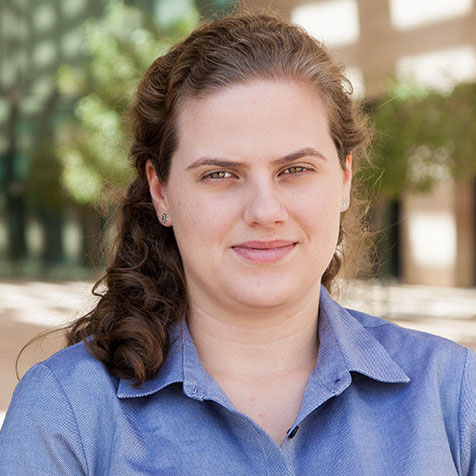

  

    

      
      

        <h2>Phillip Compeau</h2>
        
Founder and Director

        
 Phillip Compeau is a Teaching Professor of Computational Biology and the Assistant Dean for Innovation in Computing Education in the School of Computer Science at Carnegie Mellon University. He directs the [undergraduate program in computational biology](http://www.cbd.cmu.edu/education/bs-in-computational-biology/) and co-directs the [Precollege Program in Computational Biology](http://www.cbd.cmu.edu/education/pre-college-program-in-computational-biology/), both of which he co-founded.

Phillip is passionate about open online education, and his education projects have reached hundreds of thousands of learners around the world. He is the co-author of [Bioinformatics Algorithms: An Active Learning Approach](http://bioinformaticsalgorithms.org), which has been adopted by 200 instructors in 40 countries, and which powers the popular [Bioinformatics Specialization on Coursera](https://www.coursera.org/specializations/bioinformatics). He co-founded the learning platform [Rosalind](http://rosalind.info) for learning programming, bioinformatics, and algorithms through independent problem solving. He founded [Programming for Lovers](http://compeau.cbd.cmu.edu/programming-for-lovers/), an online course in introductory programming motivated by fun scientific applications.

<a href="https://compeau.cbd.cmu.edu" target="_blank">Home Page</a>

      

    

  

  

    

      
      

        <h2>Noah Yann Lee</h2>
        
Web Designer &amp; Content Developer

        
Noah Yann Lee is a PhD student at Yale University under the Computational Biology and Bioinfornatics program. Noah completed his undergraduate at Carnegie Mellon University, graduating in 2020 with a B.S. in Computational Biology with a minor in [Design for Learning](https://ideate.cmu.edu/undergraduate-programs/learning-media/index.html). From running early-childhood educational tests with the Children's School at Carnegie Mellon for the [Global Learning XPRIZE](https://www.cmu.edu/scs/robotutor/), to cultivating and sequencing phage genomes with the PhageHunters program, Noah has an appreciation for science from the micro to the macro, physical to the digital. Noah is always interested to connect with projects and organizations working with STEM, education, and science outreach.

      

    

  

  

    

      
      

        <h2>Chris Lee</h2>
        
Content Developer

        
Chris Lee is a current graduate student at Carnegie Mellon University and is in the M.S. in Computational Biology Program. Previously, he was an undergraduate student at Rutgers University and worked as an undergraduate researcher studying hydrothermal vent bacteria. In 2019, Chris graduated magna cum laude with a B.A. in Molecular Biology & Biochemistry and double minor in Chemistry and Computer Science. He is currently interested in the fields of bioinformatics and genomics.

      

    

  

  

    

      
      

        <h2>Shuanger Li</h2>
        
Content Developer

        
Shuanger is an MSc student studying Computational Biology at CMU. She is interested in theories of evolution and ecology, and is currently working with Dr. Oana Carja on heritable phenotypic variability. She enjoys modeling and simulation as powerful and fun ways to understand biological systems. She double majored in Environmental Sciences and Microbial Biology at UC Berkeley, where she studied Hawaiian arthropod assemblages, spider behaviors, and remediation bioreactors.

      

    

  

  

    

      
      

        <h2>Mert Inan</h2>
        
Content Developer

        
 Mert is currently a computer science Ph.D. student at the University of Pittsburgh. Mert is an alum of the M.S. in computational biology program at Carnegie Mellon University. He loves interdisciplinary fields and has been working at the intersection of computation, biology, neuroscience, and machine intelligence. Unlocking the secrets of biology is a pleasure that Mert truly enjoys, even under quarantine conditions.

      

    

  

  

    

      
      

        <h2>Nicole Matamala</h2>
        
Content Developer

        
Nicole Matamala is an alum of the B.S. in computational biology program at Carnegie Mellon University.

      

    

  

 

# Acknowledgements

This online course is a training and dissemination effort for the <a href="https://mmbios.pitt.edu" target="_blank">National Center for Multiscale Modeling of Biological Systems (MMBioS)</a>. It is supported by the National Institutes of Health (grant ID: P41 GM103712).

We would first and foremost like to thank everyone working on MMBioS software; their work allowed this project to come about. Chiefly, thank you to the other members of our training and dissemination team (Alex Ropelewski, Joe Ayoob, and Rozita Laghaei) as well as the head of the MMBioS consortium, Jim Faeder.

We are also very grateful to Wendy Velasquez Ebanks, Julien Gomez, Yanjing Li, Ulani Qi, Aditya Parekh, and Shalini Panthangi, who provided additional work on the course during its conception.

Module 1 was in part inspired by Uri Alon's research and superlative book <a href="https://www.amazon.com/Introduction-Systems-Biology-Mathematical-Computational/dp/1439837171" target="_blank"><i>An Introduction to Systems Biology</i></a>, a landmark biological textbook that we strongly recommend if you are interested in a greater discussion of biological network motifs.

Special thanks to Jiayi Shou for the analogy in Module 3 of new protein companies rising like "bamboo shoots after the rain".

The cover image on Module 4 was created by Keith Chambers.

Finally, the website design was built using Michael Rose's excellent <a href="https://mmistakes.github.io/minimal-mistakes/" target="_blank">Minimal Mistakes</a> theme.

