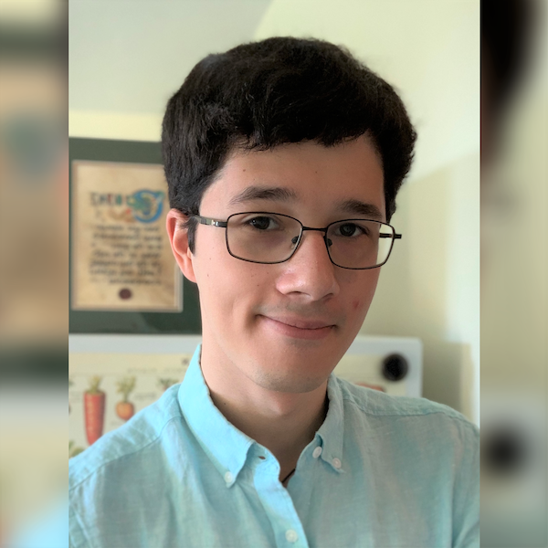
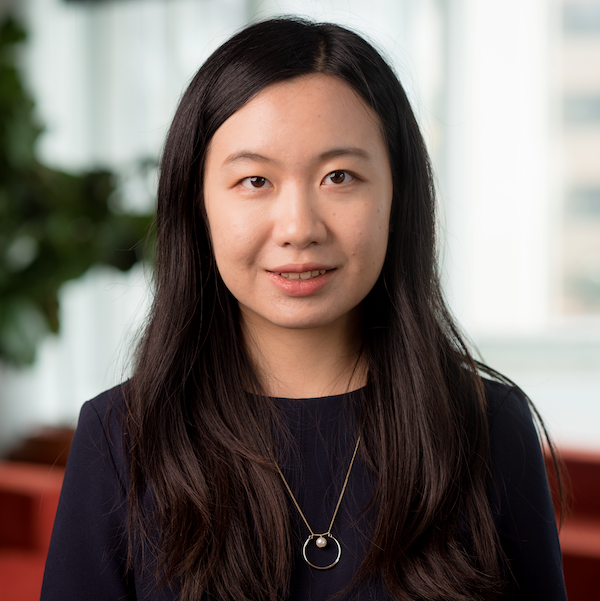

# Meet the Team

  

    

      
      

        <h2>Phillip Compeau</h2>
        
Project Founder and Head

        
 Phillip Compeau is an Associate Teaching Professor and the Assistant Department Head for Education in the [Computational Biology Department](http://cbd.cmu.edu) in Carnegie Mellon University's School of Computer Science. He directs the [undergraduate program in computational biology](http://www.cbd.cmu.edu/education/bs-in-computational-biology/), co-directs the [Precollege Program in Computational Biology](http://www.cbd.cmu.edu/education/pre-college-program-in-computational-biology/), and serves as Assistant Director of the [Master's in Computational Biology program](http://www.cmu.edu/ms-compbio/).

Phillip is passionate about open online education, and his education projects have reached hundreds of thousands of learners around the world. He is the co-author of [Bioinformatics Algorithms: An Active Learning Approach](http://bioinformaticsalgorithms.org), which has been adopted in over 140 institutions around the world. This textbook powers the popular [Bioinformatics Specialization on Coursera](https://www.coursera.org/specializations/bioinformatics). He co-founded the learning platform [Rosalind](http://rosalind.info) for learning programming, bioinformatics, and algorithms through independent problem solving.  Finally, Phillip is the founder of [Programming for Lovers](http://compeau.cbd.cmu.edu/programming-for-lovers/), an online course in introductory programming motivated by fun scientific applications.

        
<button class="button" href="http://compeau.cbd.cmu.edu">Home Page</button>

      

    

  

  

    

      
      

        <h2>Noah Yann Lee</h2>
        
Web Designer &amp; Content Developer

        
Noah Yann Lee is a PhD student at Yale University under the Computational Biology and Bioinfornatics program. Noah completed his undergraduate at Carnegie Mellon University, graduating in 2020 with a B.S. in Computational Biology with a minor in [Design for Learning](https://ideate.cmu.edu/undergraduate-programs/learning-media/index.html). From running early-childhood educational tests with the Children's School at Carnegie Mellon for the [Global Learning XPRIZE](https://www.cmu.edu/scs/robotutor/), to cultivating and sequencing phage genomes with the PhageHunters program, Noah has an appreciation for science from the micro to the macro, physical to the digital. Noah is always interested to connect with projects and organizations working with STEM, education, and science outreach

      

    

  

  

    

      
      

        <h2>Chris Lee</h2>
        
Content Developer

        
Chris Lee is a current graduate student at Carnegie Mellon University and is in the M.S. in Computational Biology Program. Previously, he was an undergraduate student at Rutgers University and worked as an undergraduate researcher studying hydrothermal vent bacteria. In 2019, Chris graduated magna cum laude with a B.A. in Molecular Biology & Biochemistry and double minor in Chemistry and Computer Science. He is currently interested in the fields of bioinformatics and genomics.

      

    

  

  

    

      
      

        <h2>Shuanger Li</h2>
        
Content Developer

        
Shuanger is an MSc student studying Computational Biology at CMU. She is interested in theories of evolution and ecology, and is currently working with Dr. Oana Carja on heritable phenotypic variability. She enjoys modeling and simulation as powerful and fun ways to understand biological systems. She double majored in Environmental Sciences and Microbial Biology at UC Berkeley, where she studied Hawaiian arthropod assemblages, spider behaviors, and remediation bioreactors.

      

    

  

  

    

      
      

        <h2>Mert Inan</h2>
        
Content Developer

        
 Mert is currently a computer science Ph.D. student at the University of Pittsburgh. Mert is an alum of the M.S. in computational biology program at Carnegie Mellon University. He loves interdisciplinary fields and has been working at the intersection of computation, biology, neuroscience, and machine intelligence. Unlocking the secrets of biology is a pleasure that Mert truly enjoys even under quarantine conditions.

      

    

  

  

    

      
      

        <h2>Nicole Matamala</h2>
        
Content Developer

        
Nicole Matamala is an alum of the B.S. in computational biology program at Carnegie Mellon University.

      

    

  

